# 🗺️ Customer Success Journey

## Purpose

Illustrates the complete customer journey with Virtual Building Studio.

```mermaid
flowchart LR

A[Lead] --> B[Sales Qualified]
B --> C[Customer Onboarding]
C --> D[Kickoff Meeting]
D --> E[Project Delivery]
E --> F[Customer Adoption]
F --> G[Monthly Business Review]
G --> H[Quarterly Business Review]
H --> I[Renewal]
I --> J[Expansion]
J --> K[Customer Advocate]
```

## Key Insight

Customer Success is a continuous lifecycle focused on delivering value and building long-term partnerships.
