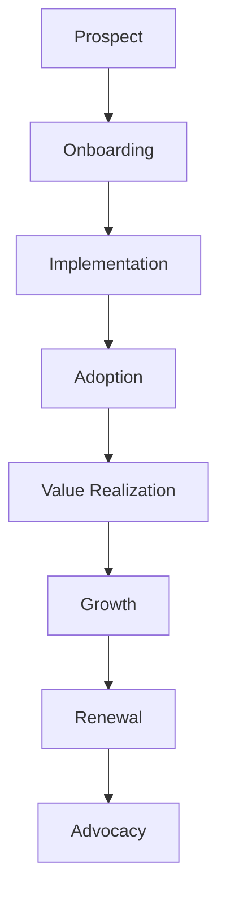

# 🔄 Customer Lifecycle

```mermaid
graph TD

A[Prospect]
A --> B[Onboarding]

B --> C[Implementation]

C --> D[Adoption]

D --> E[Value Realization]

E --> F[Growth]

F --> G[Renewal]

G --> H[Advocacy]
```

## Objective

Demonstrates the progression of a customer relationship from acquisition to advocacy.
