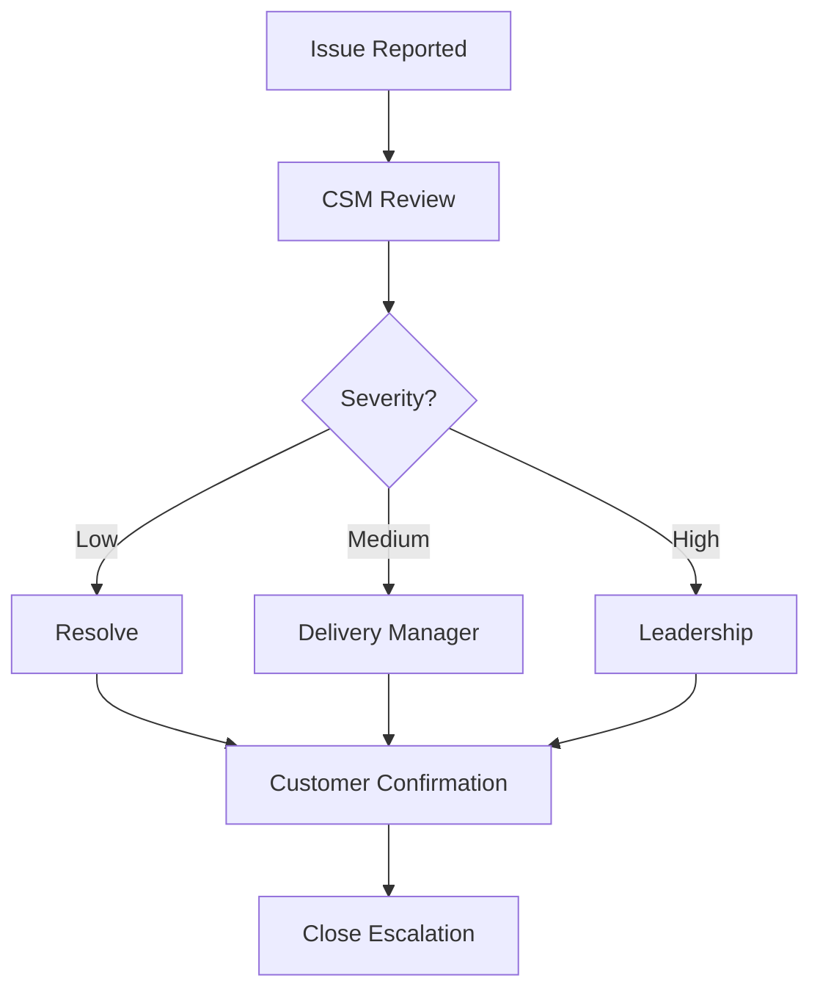

# 🚨 Escalation Workflow

```mermaid
flowchart TD

A[Issue Reported]

A --> B[CSM Review]

B --> C{Severity?}

C -->|Low| D[Resolve]

C -->|Medium| E[Delivery Manager]

C -->|High| F[Leadership]

D --> G[Customer Confirmation]

E --> G

F --> G

G --> H[Close Escalation]
```

## Objective

Ensure every escalation follows a consistent and transparent process.
